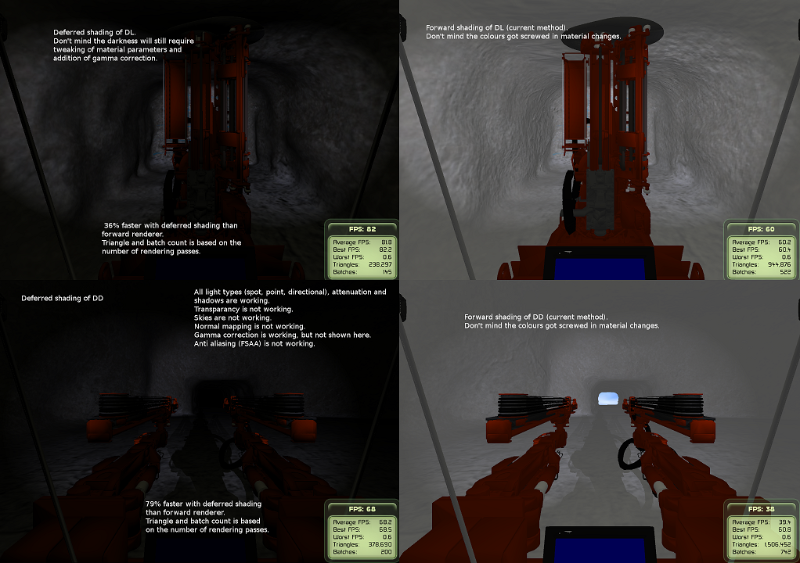

# Deferred Shading

## Why this example
1. Showcases performance testing in the domain of Computer graphics
2. Real-world case where performance was found to be the bottleneck (good performance is 120 Hz, adequate is 30-60 Hz). Ours was 10-30 Hz before optimisation.
3. Complex testing (graphics processors are notoriously hard to debug)
 * Requires outputing debug data into a picture
 * Stepping through frames and checking picture data
4. Programming GPUs is a completely different ball game than CPUs (4 processors vs. hundreds)
5. 3D graphics require solid mathematics esp. linear algebra.

## Intro to Computer Graphics
In computer graphics we can program graphics processors (GPUs)
GPUs are special in that they have 700-4000 parrallel processors.
We use GLSL (OpenGL) or HLSL (DirectX) to write graphics code that can be parralalized easily.
Which leads us to Vertex and Pixel Programs.
Vertex Programs are run on each vertex of a 3D object.
Pixel Programs are run on each pixel of a rendered picture.

For example:
Cube has 8 or 24 vertices (corners) but render it in Full HD and it requires 2 million pixels.
So it requires the vertex program to be run 8 or 24 times and the pixel program to be run 2 million times.

## What is deferred shading
In traditionally rendering (also called Forward rendering) the whole scene is rendered once for each light. So if we have five lights the same scene is rendered five times and then the result is combined for the final image.

#### High-level
Forward
```
for each l in lights:
    render_geometry(l)
    render_light(l)
combine all images
```

Deferred
```
render geometry into GBuffer
for each l in lights:
    render(GBuffer, l)
combine all images
```

With a complex scene you reduce millions of vertices (geometry) into a single G-Buffer (image) that is a lot faster to render for each light.

Deferred shading requires an extra render pass for G-buffer so in simple cases where we have either simple geometry or a single light source it's going to be slower, but for real world cases it's almost always faster. It has other issues though so in some cases it's not the best choice.


## Results
The following picture is a comparison of forward and deferred shading with complex geometry and multiple lights.



## Shaders
C style language with no memory allocations and built in vectors/matrices

* pass: a single picture is created
* uniform: parameter that stays the same for the whole pass
* in/attribute: input parameter that changes between calls (per vertex, fragment)
* out/varying: output parameter that changes

Types:
* vecX - vector types
* matX - matrix types
* sampler - texture type, indexed with uvs (tuples with 2 or 3 components)

## Code
In general pixel programs end in \_fp.glsl
Vertex programs end in \_vp.glsl

## Deferred:
* Vertex programs do very little
* geometry_pass_fp creates a G-buffer
* light_pass_fp uses the G-buffer data (provided as a texture) to calculate the lighting for one light
* lighting_utils.glsl contains light math functions

#### Structure
Geometry pass
1. Calculate position -> output to first texture.
2. Calculate normals -> output to second texture.
3. Calculate surface colour -> output to third texture.

Light pass
1. Retrieve geometry pass data from textures.
2. Calculate distance based attenuation (intensity drop).
3. Calculate spotlight attenuation (intensity drop).
4. Calculate shadows.
5. Bling-Phong shading.


### Forward:
* eye_space_sl_vs.glsl transforms vertex for lighting calculations
* bling_phon_sl_ps.glsl calculates the pixel value for single light
* lighting_utils.glsl contains light math functions

#### Structure
Vertex program: converts data from model space to eye space (camera space).

Fragment program:
1. Calculate spotlight attenuation (instensity drop).
2. Calculate distance based attenuation (intensity drop).
3. Get textures if used.
4. Bling-Phong shading.
5. Darken if the fragment is in shadow.
